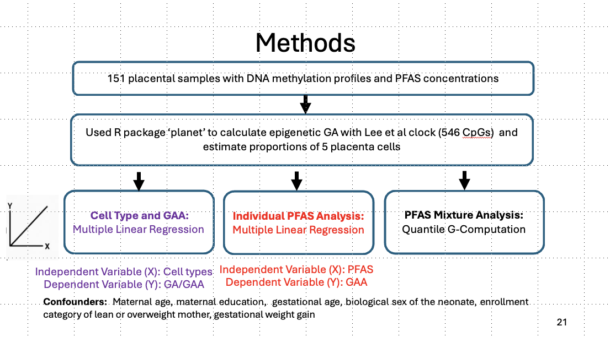

# PFAS and GAA Analysis
Primary analysis of the effects of per- and polyfluoroalkyl substances (PFAS) on gestational age acceleration (GAA) and 5 estimated cell type proportions from human placental DNA methylation data. The results of this analysis are published in Environmental Research: [https://doi.org/10.1016/j.envres.2025.120868]. 
## Project Context
PFAS are persistent pollutants that can accumulate in the placenta and contribute to neonatal health outcomes like low birthweight. We utilized GAA and estimated the cell type proportion to measure overall developmental maturation and whether PFAS perturbs these factors. 

## Methods  

## Data Availability 
This analysis uses publicly available placental DNA methylation data from the Gene Expression Omnibus (GEO):
**GSE288358 – Placental PFAS concentrations are associated with perturbations of placental DNA methylation**  
Available at: [https://www.ncbi.nlm.nih.gov/geo/query/acc.cgi?acc=GSE288358]
Please refer to the original study for data processing and sample description details.
If using this dataset, cite the original authors:
> Everson TM, Sehgal N, Campbell K, Barr DB et al. Placental PFAS concentrations are associated with perturbations of placental DNA methylation. Environ Pollut 2025 Mar 1;368:125737. PMID: 39862910

> Perez C, Sehgal N, Eick SM, Barr DB et al. Sex-specific effects of in utero exposure to per- and polyfluoroalkyl substances on placental development. Environ Res 2025 Apr 1;270:120868. PMID: 39884538

## Disclaimer
This repository does not include individual-level PFAS exposure and phenotype data used in the original study. However, data simulations may be generated using mean, SD, and other statistical metrics shared in published works. 

## Archive Folder
This folder contains earlier versions of scripts and exploratory analyses that were useful during method development. They are not part of the main workflow but are retained for transparency.

## Key Steps
1. Load data 
2. Linear regression analysis (CPC_GAA_PFAS_Cell_analysis.Rmd)
3. Mixture analysis (qgcomp_analysis.Rmd) 
4. Generate summary tables & figures

